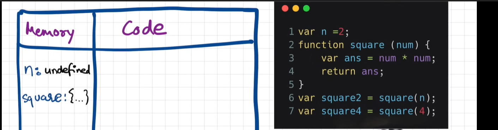

## How Javascript Works? 

**Everything in JS happens inside Execution Context**

Execution Context is like a big box which has two components in it.   
1. Memory Component: This is the place where all the variables and functions are stored as key value pairs.  It is also known as Variable Environment.

2. Code Component: This is the place where code is executed one line at a time. It is also known as thread of execution. 

**Javascript is Synchronous single threaded language**. 

**Synchronous** means in a specific order  
**Single threaded** means single command at a time.

- When we run a JS program an execution context is created. This execution context is created in two phases. The first Phase is also known as the _creation phase_ or memory creation phase. 
    ```js
    var n = 2; 
    function square(num){
        var ans = num * num;
        return ans;
    } 
    var square2 = square(2);
    var square4 = square(4);
    ```
In the first phase js skims through the whole program and allocates memory to all variables and functions.  When js sees ``var n = 2`` It stores n inside the memory block and value is undefined. In case of function square it literally stores the whole code of the function. 
  
similarly to ``square2`` and ``square4`` with value as undefined.   

In the second phase which is known as the code execution phase. In this phase too JS runs skims through the whole source code and it executes the code. This is the point when all the function and calculations are done. When it sees ``var n=2`` it then changes the value of n in memory component from undefined to 2. Now under it is the function definition so there's nothing to execute. So it skips that part, and in the next lines they are invoked Now whenever a new function is invoked a new execution context is created as well. 

When an invoked function is seen new execution context is created and in first phase meory is allocated to params and variables inside the function. 
In the second phase which is code execution phase values are assigned and once return statement is encountered it states to return the control of the program to the place where function was invoked.
And the local execution context that was created will now be deleted. 

And when the whole program gets completed the whole exceution context goes off. 