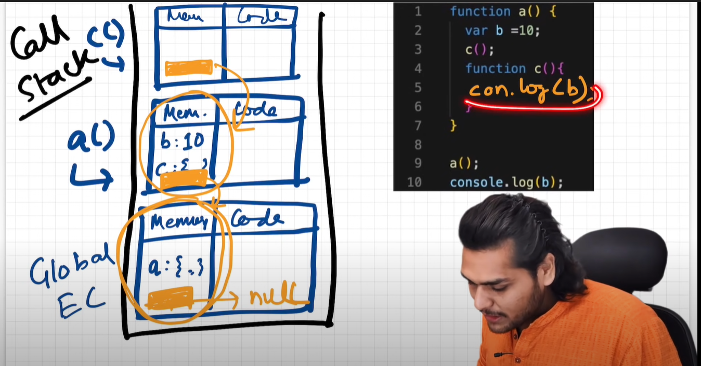

## Scope 

Scope in general means place where you can access a variable or a function. 
```js
function a(){
    console.log(b);
}
var b= 10; 
a(); // 10
```
Upon invoking the function ``a`` it will print 10 because in the first phase which is memory creation memory will be allocated to the function as well as the variable b. In the execution phase it starts from the top and assignment is done to ``b = 10`` Now upon invoking the function ``a`` will it will look for the variable ``b`` but would not find it and then will look for ``b`` in the global execution context where it will be able to find it and thus print 10. 


Whenever a function invocation happens an execution context is created and
Whenever an execution context is created along with it a lexical environment is created too. So lexical environment is the local memory along with the lexical environment of its parent. 

lexical is a term which means to be in sequence. 

```js
function b(){
    var b = 10;
    function c(){
        console.log(b);
    }
    c();
}
b();
```

Whenever a function is invoked execution context is created with the lexical environment of its parent. 


The Yellow portion denotes the lexical environment of its parent. So when a variable is need to be searched it first sees in its local memory if it doesnt find it there it will go to its lexical environment of it's parent. 

So the upper mechanism of finding these variables is known as scope chain. 