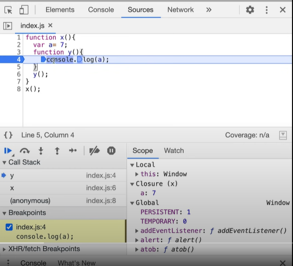

## Closures

A closure is the combination of a function bundled together (enclosed) with references to its surrounding state (the lexical environment). In other words, a closure gives you access to an outer function’s scope from an inner function. In JavaScript, closures are created every time a function is created, at function creation time.

```js
function a(){
  let a = 10;
  return function b(c){ // here we are returning the closure function enclosed with the             environment             (lexical scope)
      return a + c;  // as we are returning the function it is having the value of a too but hasnt done anything yet with it
  }
}

  let valueA= a(); // Here since a is invoked it creates an execution context but that gets deleted when it 
                   // goes to the next line but since the function is returned it creates a closure on to the 
                   // parent function and still remembers the value of a due to closure. 
                   
  console.log(valueA(5)); // here it will remember the value of a due to closure 
```

