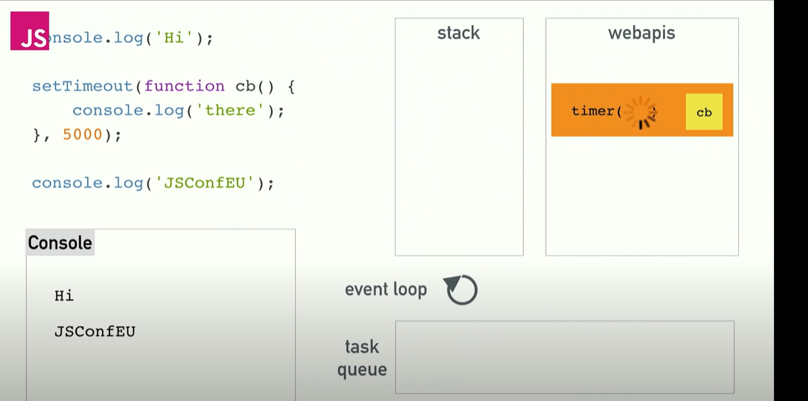
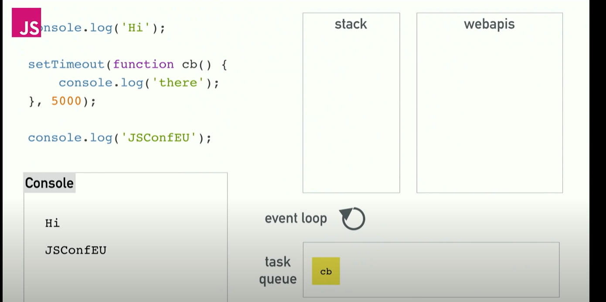

## Event Loops
Problem with synchronous calls are they tend to block the main thread and no other processes can then take place until one on the thread is fully executed. 

And the solution to it is asynchronous call backs. 

**How does asynchronous callbacks run?**
```js
console.log('FIRST');
setTimeout(function (){
    console.log('THIRD ');
}, 3000);

console.log('SECOND');
```
> FIRST  
> SECOND   
> THIRD  

so here js starts executing with the log then encounters timeout but doesn't execute it and then logs again clears the stack but after timeout the stack appears again with setTimeout.

So here is where the concurrency and event loops come in. The reason why we can do things concurrently is due to browser. JS engine can do only thing at a time but the browser gives us some other things too. 

So what happens above is we call log for FIRST, move into stack execute it then move on next line see this setTimeout with a callback and delay move into stack which kicks on a ``web api`` called timer provided to us by the browser and its gonna handle the countdown. So after the delay is completed it doesn't actually throw the result into the stack instead it stores it into the task queue. It is for all the web apis when they're done they are pushed on to the task queue. 



So there are actually two types of queues callback queues and micro task queues. They serve different purposes, Microtask Queue has higher priority. All the callback functions coming through Promises and Mutation Observer will go inside the Microtask Queue. For example, in the case of .fetch(), the callback function gets to the Microtask Queue. Promise handling always has higher priority so the JavaScript engine executes all the tasks from Microtask Queue and then moves to the Callback Queue.

And after this task queue event loops come into the play. and it has one very simple job to look at the stack and look at the task queue, if the task is empty it takes first thing on the queue pushes it on the stack which is it executes it. 


So event loop actually waits for the stack to be clear before picking up tasks from task queue. 
Javascript is a single-threaded non-blocking asynchronous concurrent  language. It has one call stack and it can do only one thing at a time. It is present in the JS engine. 
Concurrent means it can do computations in overlapping time periods rather than sequentially. 

It has a call stack and an event loop, a callback queue and some other apis. 

> one thread == one call stack == one thing at a time.
