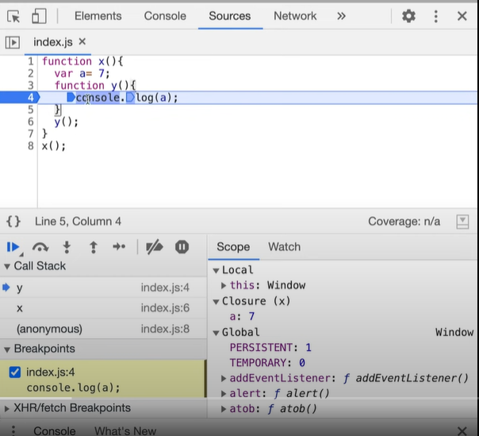
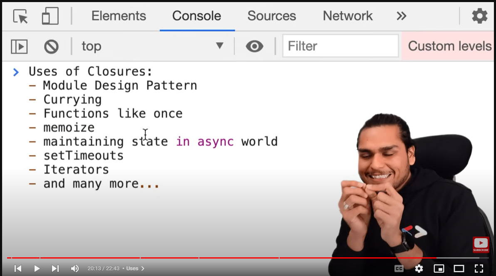

## Closures

**A closure is the combination of a function bundled together (enclosed) with references to its surrounding state (the lexical environment)**. In other words, a closure gives you access to an outer function’s scope from an inner function. In JavaScript, closures are created every time a function is created, at function creation time.

```js
function a(){
  let a = 10;
  return function b(c){ // here we are returning the closure function enclosed with the             environment             (lexical scope)
      return a + c;  // as we are returning the function it is having the value of a too but hasnt done anything yet with it
  }
}

  let valueA= a(); // Here since a is invoked it creates an execution context but that gets deleted when it 
                   // goes to the next line but since the function is returned it creates a closure on to the 
                   // parent function and still remembers the value of a due to closure. 
                   
  console.log(valueA(5)); // here it will remember the value of a due to closure 
```
Whenever we will need something to remember its properties last value we can use closure for that.

```
function a(){
  let a1 = 20;
    function b(){
      let b1 = 30;
        function c(){
          let c1 = 40;
          console.log(a1,b1,c1);
        }
        c();
    }
    b()
}
a();
```
Closures remember the reference to a variable and not the actual variable. 
### Uses Of Closure


### Tricky Set Timeout and closure 

```
function a(){
  let i = 1; 
  setTimeout(function () {
    console.log(i)  // forms a closure with a
  }, 3000)
  console.log('Javascript');
}

a(); 
// Output
Javascript
1
```
So the setTimeout doesn't wait for 3 secs and then print Javascript instead it takes the callback attaches a timer to it of 3 seconds and then after 3 seconds are done it pushes it on the stack and executes it. 


```
function x(){
  for(var i = 1; i<= 5; i++){
    setTimeout(function () {
      console.log(i);
    }, i * 1000;)
  }
  console.log("Javascript");
}
x(); 
``` 
Expected behaviour in above code is to print 1...5 in sequence after every second but that wont happen here. Here the callback to setTimeout function remebers the reference to i forming a closure. so all five i in the for loop is referencing to the same value. 
and setTimeout wont wait for anything and will keep on executing the loop. will just store these functions with the timers and move on. 

And when the timer expires it prints 6 as the loop was constantly running. 

so whats the solution to it? 

The problem lies how i is intialized, i is intialized using var keyword which doesn't create new variable but keeps on referencing the same variable. so if we use let for every iteration it will create a new variable i and assign it to the callback each having its own reference to i. Let is block scoped. 

We can even make this work with closures and var 

```
function a(){
  for(var i = 1; i<= 5; i++){
    function close(i){
      setTimeout(function () {
        console.log(i);
      }, i * 1000);
    }
    close(i);
  }
}
a();
```
Why this works because close() invocation in every iteration will create a new i that was what was happenign when using let keyword. 