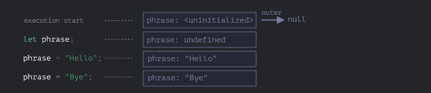

## Variable Scope

- Nested Functions

A function is called “nested” when it is created inside another function.

```js
function sayHiBye(firstName, lastName) {

  // helper nested function to use below
  function getFullName() {
    return firstName + " " + lastName;
  }

  alert( "Hello, " + getFullName() );
  alert( "Bye, " + getFullName() );
}

sayHiBye('Tushar', 'Roy');
```
 A nested function can be returned: either as a property of a new object or as a result by itself. It can then be used somewhere else. No matter where, it still has access to the same outer variables.
 Example: 
 ```js

 function makeCounter() {
  let count = 0;

  return function() {
    return count++;
  };
}

let counter = makeCounter();

alert( counter() ); // 0
alert( counter() ); // 1
alert( counter() ); // 2
 ```
 Here counter function call has access to the same variable count whenever it is callled.
### Lexical Environment
#### Variables
 In JavaScript, every running function, code block ``{...}``, and the script as a whole have an internal (hidden) associated object known as the _Lexical Environment_.

The Lexical Environment object consists of two parts:

_Environment Record_ – an object that stores all local variables as its properties (and some other information like the value of ``this``).
A reference to the outer lexical environment, the one associated with the outer code.

- A “variable” is just a property of the special internal object, Environment Record. “To get or change a variable” means “to get or change a property of that object”.

In this simple code without functions, there is only one Lexical Environment:


- There is a __global lexical Environment__ which is associated with the whole script. The Environment record contains all the variables. 

On the picture above, the rectangle means Environment Record (variable store) and the arrow means the outer reference. The global Lexical Environment has no outer reference, that’s why the arrow points to ``null``. 

Rectangles on the right-hand side demonstrate how the global Lexical Environment changes during the execution:

As the execution satrts the lexical environment changes
1. When the script starts, the lexical environmnet is pre-populated with all declared variables. 
   It means that the engine knows about the variables but it cannnot be referenced until it has been declared with ``let``. 
2. Then wehen ``let`` appears the variable goes into an ``undefined`` state.
3. phrase is assigned a value.
4. phrase changes the value.
- For functions

#### functions 
A function is also a value, like a variable.

_The difference is that a Function Declaration is instantly fully initialized._
Like in the first stage only the function gets intialized as a function.

Naturally, this behavior only applies to Function Declarations, not _Function Expressions_ where we assign a function to a variable, such as ``let say = function(name)....``

For example, here’s the initial state of the global Lexical Environment when we add a function:


#### Inner and outer lexical Environments

When a function runs, at the beginning of the call, a new Lexical Environment is created automatically to store local variables and parameters of the call. 

During the function call we have two Lexical Environments: the inner one (for the function call) and the outer one (global):
For instance, for`` say("John")``, it looks like this (the execution is at the line, labelled with an arrow):


- The inner Lexical Environment corresponds to the current execution of say. It has a single property: ``name``, the function argument. We called ``say("John")``, so the value of the name is "John".
- The outer Lexical Environment is the global Lexical Environment. It has the ``phrase`` variable and the function itself.

The inner Lexical Environment has a reference to the outer one.

__When the code wants to access a variable – the inner Lexical Environment is searched first, then the outer one, then the more outer one and so on until the global one.__

In above example the search proceeds as follows:

- For the name variable, the alert inside say finds it immediately in the inner Lexical Environment.
- When it wants to access phrase, then there is no phrase locally, so it follows the reference to the outer Lexical Environment and finds it there. 


#### Returning a function

If a funtion returns another function then in that case :
```js
function makeCounter(){
  let count = 0 ; 
  return function(){
    count++;
  }
}
let counter = makeCounter();
```
At the beginning of each ``makeCounter()`` call, a new Lexical Environment object is created, to store variables for this ``makeCounter`` run.

So we have two nested Lexical Environments, just like in the example above:


What’s different is that, during the execution of makeCounter(), a tiny nested function is created of only one line: return count++. We don’t run it yet, only create.

All functions remember the Lexical Environment in which they were made. Technically, there’s no magic here: all functions have the hidden property named ``[[Environment]]``, that keeps the reference to the Lexical Environment where the function was created:


So, ``counter.[[Environment]]`` has the reference to ``{count: 0} `` Lexical Environment. That’s how the function remembers where it was created, no matter where it’s called. The ``[[Environment]]`` reference is set once and forever at function creation time.

Later, when ``counter()`` is called, a new Lexical Environment is created for the call, and its outer Lexical Environment reference is taken from ``counter.[[Environment]]``.


Now when the code inside counter() looks for count variable, it first searches its own Lexical Environment (empty, as there are no local variables there), then the Lexical Environment of the outer makeCounter() call, where it finds and changes it.

**A variable is updated in the Lexical Environment where it lives.**
Here’s the state after the execution:


#### Closure
There is a general programming term ``“closure”``.

A closure is a function that remembers its outer variables and can access them. In some languages, that’s not possible, or a function should be written in a special way to make it happen. But as explained above, in JavaScript, all functions are naturally closures (there is only one exception, to be covered in The "new Function" syntax).

That is: they automatically remember where they were created using a hidden ``[[Environment]]`` property, and then their code can access outer variables.
A question about “what’s a closure?”, a valid answer would be a definition of the closure and an explanation that all functions in JavaScript are closures, and maybe a few more words about technical details: the ``[[Environment]]`` property and how Lexical Environments work.

#### Garbage Collection
Usually, a Lexical Environment is removed from memory with all the variables after the function call finishes. That’s because there are no references to it. As any JavaScript object, it’s only kept in memory while it’s reachable.
However, if there’s a nested function that is still reachable after the end of a function, then it has ``[[Environment]]`` property that references the lexical environment.

In that case the Lexical Environment is still reachable even after the completion of the function, so it stays alive.

For example:
```js
function f() {
  let value = 123;

  return function() {
    alert(value);
  }
}

let g = f(); // g.[[Environment]] stores a reference to the Lexical Environment
// of the corresponding f() call
```

In the code below, after the nested function is removed, its enclosing Lexical Environment (and hence the value) is cleaned from memory:
```js 
function f() {
  let value = 123;

  return function() {
    alert(value);
  }
}

let g = f(); // while g function exists, the value stays in memory

g = null; // ...and now the memory is cleaned up
```

Please note that if f() is called many times, and resulting functions are saved, then all corresponding Lexical Environment objects will also be retained in memory. In the code below, all 3 of them:
```js
function f() {
  let value = Math.random();

  return function() { alert(value); };
}

// 3 functions in array, every one of them links to Lexical Environment
// from the corresponding f() run
let arr = [f(), f(), f()];
```
A Lexical Environment object dies when it becomes unreachable (just like any other object). In other words, it exists only while there’s at least one nested function referencing it.