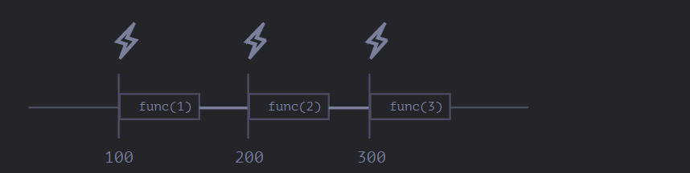
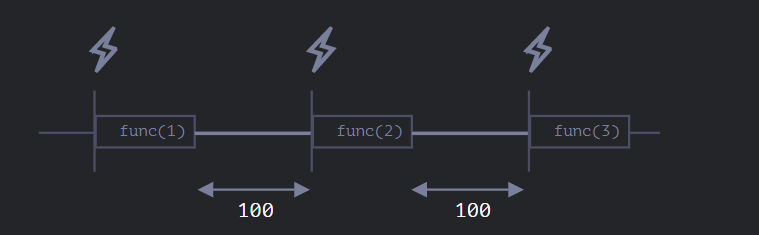

## Scheduling 

There are two methods for Scheduling:

``setTimeout`` allows us to run a function once after the interval of time.
``setInterval`` allows us to run a function repeatedly, starting after the interval of time, then repeating continuously at that interval.

### setTimeout 
The syntax:
```js
let timerId = setTimeout(func|code, [delay], [arg1], [arg2], ...) 
// The delay before run, in milliseconds (1000 ms = 1 second), by default 0
```

With arguments:
```js
function sayHi(phrase, who) {
  alert( phrase + ', ' + who );
}

setTimeout(sayHi, 1000, "Hello", "John"); // Hello, John
```

We can also cancel Timer using ``clearTimeout``
```js
let timerId = setTimeout(() => alert("never happens"), 1000);
alert(timerId); // timer identifier

clearTimeout(timerId);
alert(timerId); // same identifier (doesn't become null after canceling)
```

### Nested SetTimeout

There are two ways of running something regularly.

One is ``setInterval``. The other one is a nested ``setTimeout``, like this:
```js
/** instead of:
let timerId = setInterval(() => alert('tick'), 2000);
*/

let timerId = setTimeout(function tick() {
  alert('tick');
  timerId = setTimeout(tick, 2000); // (*)
}, 2000);
```
The ``setTimeout`` above schedules the next call right at the end of the current one (*).

Nested ``setTimeout`` allows to set the delay between the executions more precisely than ``setInterval``.

Let’s compare two code fragments. The first one uses ``setInterval``:
```js
let i = 1;
setInterval(function() {
  func(i++);
}, 100);
```

The second one uses nested ``setTimeout``:

```js
let i = 1;
setTimeout(function run() {
  func(i++);
  setTimeout(run, 100);
}, 100);
```
For ``setInterval`` the internal scheduler will run ``func(i++)`` every 100ms:


**The real delay between func calls for setInterval is less than in the code!** 
That’s normal, because the time taken by ``func's`` execution “consumes” a part of the interval.
It is possible that func's execution turns out to be longer than we expected and takes more than 100ms.

In this case the engine waits for ``func`` to complete, then checks the scheduler and if the time is up, runs it again immediately.
In the edge case, if the function always executes longer than delay ms, then the calls will happen without a pause at all.

And here is the picture for the nested setTimeout:

The nested ``setTimeout`` guarantees the fixed delay (here 100ms).

**That’s because a new call is planned at the end of the previous one.**
```js
function getFunc() {
  let value = "test";

  let func = new Function('alert(value)');

  return func;
}

getFunc()(); // error: value is not defined
```

### setInterval
The setInterval method has the same syntax as setTimeout:
```js
let timerId = setInterval(func|code, [delay], [arg1], [arg2], ...)
```
Unlike setTimeout it runs the function not only once, but regularly after the given interval of time.
To stop further calls, we should call clearInterval(timerId).
```js
// repeat with the interval of 2 seconds
let timerId = setInterval(() => alert('tick'), 2000);

// after 5 seconds stop
setTimeout(() => { clearInterval(timerId); alert('stop'); }, 5000);
```