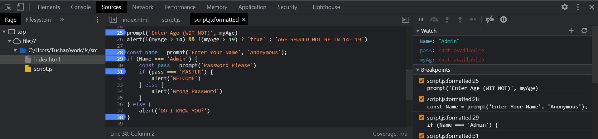

# Code Quality 
The ```source``` tab in Developer Console opens up the files from where the scripts are coming from. 

The Sources panel has 3 parts:
- The File Navigator pane lists HTML, JavaScript, CSS and other files, including images that are attached to the page. Chrome extensions may appear here too.
- The Code Editor pane shows the source code.
- The JavaScript Debugging pane is for debugging.

## Breakpoints
In Developer console we have something called ```Breakpoints```
We can set points on the code which set the breakpoints where the execution will stop. 

While the code is paused, we can examine current variables, execute commands in the console etc. In other words, we can debug it.

We can also pause the code by using the debugger command in it, like this:
```Js
function hello(name) {
  let phrase = `Hello, ${name}!`;

  debugger;  // <-- the debugger stops here

  say(phrase);
}
```

The informational dropdowns to the right (labeled with arrows). They allow you to examine the current code state:

**Watch** – shows current values for any expressions.
You can click the plus + and input an expression. The debugger will show its value at any moment, automatically recalculating it in the process of execution.

**Call Stack** – shows the nested calls chain.
At the current moment the debugger is inside hello() call, called by a script in index.html (no function there, so it’s called “anonymous”).
If you click on a stack item (e.g. “anonymous”), the debugger jumps to the corresponding code, and all its variables can be examined as well.

**Scope** – current variables.
Local shows local function variables. You can also see their values highlighted right over the source.
Global has global variables (out of any functions).

## Tracing the execution

There are buttons for it at the top of the right panel.

 – **“Resume”**: continue the execution, hotkey F8.
Resumes the execution. If there are no additional breakpoints, then the execution just continues and the debugger loses control.

 – **“Step”**: run the next command, hotkey F9.3
Run the next statement.
Clicking this again and again will step through all script statements one by one.

 – **“Step over”**: run the next command, but don’t go into a function, hotkey F10.
Similar to the previous “Step” command, but behaves differently if the next statement is a function call. That is: not a built-in, like alert, but a function of our own.

The **“Step”** command goes into it and pauses the execution at its first line, while “Step over” executes the nested function call invisibly, skipping the function internals.
The execution is then paused immediately after that function.
That’s good if we’re not interested to see what happens inside the function call.

 – **“Step into”**, hotkey F11.
That’s similar to “Step”, but behaves differently in case of asynchronous function calls. 
For the future, note that “Step” command ignores async actions, such as setTimeout (scheduled function call), that execute later. The “Step into” goes into their code, waiting for them if necessary. 

 – **“Step out”**: continue the execution till the end of the current function, hotkey Shift+F11.
Continue the execution and stop it at the very last line of the current function. That’s handy when we accidentally entered a nested call using , but it does not interest us, and we want to continue to its end as soon as possible.

 – **enable/disable** all breakpoints.
That button does not move the execution. Just a mass on/off for breakpoints.

 – **enable/disable automatic** pause in case of an error.
When enabled, and the developer tools is open, a script error automatically pauses the execution. Then we can analyze variables to see what went wrong. So if our script dies with an error, we can open debugger, enable this option and reload the page to see where it dies and what’s the context at that moment.

## Coding-Style


### Style-Guides
[Google JavaScript Style Guide](https://google.github.io/styleguide/jsguide.html)  
[Airbnb JavaScript Style Guide](https://github.com/airbnb/javascript)  
[Idiomatic.JS](https://github.com/rwaldron/idiomatic.js)  
[StandardJS](https://standardjs.com/)  

### Automated Linters
Linters are tools that can automatically check the style of your code and make improving suggestions.

The great thing about them is that style-checking can also find some bugs, like typos in variable or function names. Because of this feature, using a linter is recommended even if you don’t want to stick to one particular “code style”.

Here are some well-known linting tools:

JSLint – one of the first linters.
JSHint – more settings than JSLint.
ESLint – probably the newest one.

For ESLint you should do the following:

- Install Node.js.
- Install ESLint with the command npm install -g eslint (npm is a JavaScript package installer).
- Create a config file named .eslintrc in the root of your JavaScript project (in the folder that contains all your files).
- Install/enable the plugin for your editor that integrates with ESLint. The majority of editors have one.  
Here’s an example of an .eslintrc file:
```JSON
{
  "extends": "eslint:recommended",
  "env": {
    "browser": true,
    "node": true,
    "es6": true
  },
  "rules": {
    "no-console": 0,
    "indent": 2
  }
}
```
Here the directive "extends" denotes that the configuration is based on the “eslint:recommended” set of settings. After that, we specify our own.

## Automated Testing with Mocha 

Automated testing means that tests are written separately, in addition to the code. They run our functions in various ways and compare results with the expected.

### Behavior Driven Development (BDD)
Let’s start with a technique named Behavior Driven Development or, in short, BDD.
BDD is three things in one: tests AND documentation AND examples.
To understand BDD, we’ll examine a practical case of development.

- **Development of “pow”: the spec**
Let’s say we want to make a function pow(x, n) that raises x to an integer power n. We assume that n≥0.
Before creating the code of pow, we can imagine what the function should do and describe it.

Such description is called a specification or, in short, a spec, and contains descriptions of use cases together with tests for them, like this:
```JS
describe("pow", function() {

  it("raises to n-th power", function() {
    assert.equal(pow(2, 3), 8);
  });

});
```
A spec has three main building blocks that you can see above:
describe("title", function() { ... })
What functionality we’re describing. In our case we’re describing the function pow. Used to group “workers” – the it blocks.

```it("use case description", function() { ... })```
In the title of it we in a human-readable way describe the particular use case, and the second argument is a function that tests it.

```assert.equal(value1, value2)```
The code inside it block, if the implementation is correct, should execute without errors.
Functions assert.* are used to check whether pow works as expected.

### The development flow
The flow of development usually looks like this:

1. An initial spec is written, with tests for the most basic functionality.
2. An initial implementation is created.
3. To check whether it works, we run the testing framework Mocha (more details soon) that runs the spec. While the functionality is not complete, errors are displayed. We make corrections until everything works.
4. Now we have a working initial implementation with tests.
5. We add more use cases to the spec, probably not yet supported by the implementations. Tests start to fail.
6. Go to 3, update the implementation till tests give no errors.
7. Repeat steps 3-6 till the functionality is ready.

So, the development is iterative. We write the spec, implement it, make sure tests pass, then write more tests, make sure they work etc.

- we’ll be using the following JavaScript libraries for tests:

 **Mocha** – the core framework: it provides common testing functions including describe and it and the main function that runs tests.
**Chai** – the library with many assertions. It allows to use a lot of different assertions, for now we need only assert.equal.
**Sinon** – a library to spy over functions, emulate built-in functions and more

When assert triggers an error, the ```it``` block immediately terminates. So, in the first variant if the first assert fails, then we’ll never see the result of the second assert.

##  how to make our modern code work on older engines that don’t understand recent features yet?

There are two tools for that:

1. Transpilers.
2. Polyfills.

### Transpilers
A transpiler is a special piece of software that translates source code to another source code. It can parse (“read and understand”) modern code and rewrite it using older syntax constructs, so that it’ll also work in outdated engines.  
E.g. JavaScript before year 2020 didn’t have the “nullish coalescing operator” ??. So, if a visitor uses an outdated browser, it may fail to understand the code like height = height ?? 100.

A transpiler would analyze our code and rewrite height ?? 100 into (height !== undefined && height !== null) ? height : 100.

### Polyfills
New language features may include not only syntax constructs and operators, but also built-in functions.

For example, Math.trunc(n) is a function that “cuts off” the decimal part of a number, e.g Math.trunc(1.23) returns 1.

A script that updates/adds new functions is called “polyfill”. It “fills in” the gap and adds missing implementations.