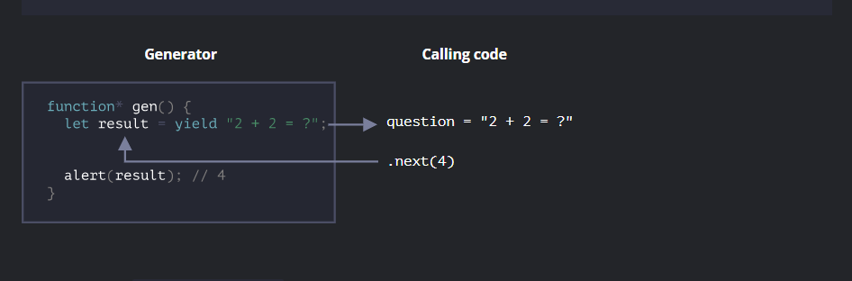
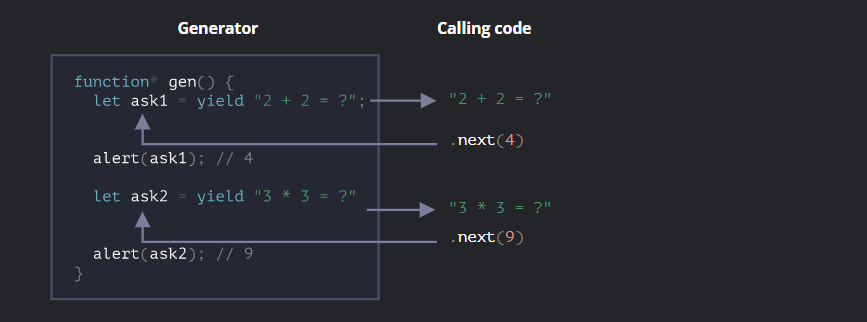

### Generators
Regular functions return only one, single value (or nothing).

Generators can return (“yield”) multiple values, one after another, on-demand. They work great with iterables, allowing to create data streams with ease.

To create a generator, we need a special syntax construct: ``function*``, so-called “generator function”.

It looks like this:
```js
function* generateSequence() {
  yield 1;
  yield 2;
  return 3;
}
```
Generator functions behave differently from regular ones. When such function is called, it doesn’t run its code. Instead it returns a special object, called “generator object”, to manage the execution.

```js
function* generateSequence() {
  yield 1;
  yield 2;
  return 3;
}

// "generator function" creates "generator object"
let generator = generateSequence();
alert(generator); // [object Generator]
```

The main method of a generator is ``next()``. When called, it runs the execution until the nearest ``yield <value>`` statement. Then the function execution pauses, and the yielded value is returned to the outer code. The result of ``next()`` is always an object with two properties:
_value_: the yielded value.
_done_: ``true`` if the function code has finished, otherwise ``false``.
example: 
```js
function* generateSequence() {
  yield 1;
  yield 2;
  return 3;
}

let generator = generateSequence();

let one = generator.next();

alert(JSON.stringify(one)); // {value: 1, done: false}
let two = generator.next();

alert(JSON.stringify(two)); // {value: 2, done: false}
let three = generator.next();

alert(JSON.stringify(three)); // {value: 3, done: true}
```

## Generators are iterables
We can loop over their values using ``for..of``:
```js
function* generateSequence() {
  yield 1;
  yield 2;
  return 3; // yield 3 if wewnat this to come in for..of
}

let generator = generateSequence();

for(let value of generator) {
  alert(value); // 1, then 2
}
```
This works because ``for..of`` works because it works with the returned obejct which has a ``next`` method in it.   

The example above shows 1, then 2, and that’s all. It doesn’t show 3!
It’s because ``for..of`` iteration ignores the last value, when ``done: true``. So, if we want all results to be shown by ``for..of``, we must return them with yield. 
As generators are iterable, we can call all related functionality, e.g. the spread syntax ``...``:
```js
function* generateSequence() {
  yield 1;
  yield 2;
  yield 3;
}

let sequence = [0, ...generateSequence()];

alert(sequence); // 0, 1, 2, 3
```

### Using generators in iterables 
we created an iterable object which returned values ``from..to``. This can be made more compact using generators
```js
let range = {
  from: 1
  to: 5 

  *[Symbol.iterator]() { // a shorthand for [Symbol.iterator]: function*()
      for(let value = this.from ; value <=  this.to; value++){
        yield value;
      }
  }
}
alert(...range)
```
That works, because range[Symbol.iterator]() now returns a generator, and generator methods are exactly what `` for..of`` expects:

- it has a ``.next()`` method
- that returns values in the form ``{value: ..., done: true/false}``

### *yield
The ``yield*`` expression is used to delegate to another generator or iterable object.

**_Syntax_**
``yield* expression``

_expression_
The expression which returns an iterable object.

The ``yield*`` expression iterates over the operand and yields each value returned by it.
Example: 
```js
function* func1() {
  yield 42;
  yield 34;
}

function* func2() {
  yield* func1();
  yield 2;
}

const iterator = func2();

console.log(iterator.next().value); //42
console.log(iterator.next().value); // 34
console.log(iterator.next().value); // 2
console.log(iterator.next().value); // undefined
```
Another Example: 
```js
function* g1() {
  yield 2;
  yield 3;
  yield 4;
}

function* g2() {
  yield 1;
  yield* g1();
  yield 5;
}

const iterator = g2();

console.log(iterator.next()); // {value: 1, done: false}
console.log(iterator.next()); // {value: 2, done: false}
console.log(iterator.next()); // {value: 3, done: false}
console.log(iterator.next()); // {value: 4, done: false}
console.log(iterator.next()); // {value: 5, done: false}
console.log(iterator.next()); // {value: undefined, done: true}

```
### Generator composition

Generator composition is a special feature of generators that allows to transparently “embed” generators in each other.
```js
function* generateSequence(start, end) {
  for (let i = start; i <= end; i++) yield i;
}
```

For instance, we have a function that generates a sequence of numbers:
```js
function* generateSequence(start, end) {
  for (let i = start; i <= end; i++) yield i;
}
```
Now we’d like to reuse it to generate a more complex sequence:

- first, digits 0..9 (with character codes 48…57),
- followed by uppercase alphabet letters A..Z (character codes 65…90)
- followed by lowercase alphabet letters a..z (character codes 97…122)

In a regular function, to combine results from multiple other functions, we call them, store the results, and then join at the end.

For generators, there’s a special yield* syntax to “embed” (compose) one generator into another.
```js
The composed generator:

function* generateSequence(start, end) {
  for (let i = start; i <= end; i++) yield i;
}

function* generatePasswordCodes() {

  // 0..9
  yield* generateSequence(48, 57);

  // A..Z
  yield* generateSequence(65, 90);

  // a..z
  yield* generateSequence(97, 122);

}

let str = ''; // 1 

for(let code of generatePasswordCodes()) { 
  str += String.fromCharCode(code);
}
```

Flow of the program: 
1. str is intialized
2. ``generatePasswordCodes()`` is called which calls ``yield* generateSequence(48, 57);`` which calls 
   ``
   function* generateSequence(start, end) {
  for (let i = start; i <= end; i++) yield i;
}
`` 
yields a value and then returns to the for loop in which str is given it's first value. 
The ``yield*`` directive delegates the execution to another generator. This term means that ``yield* gen`` iterates over the generator ``gen`` and transparently forwards its yields outside.

The **yield*** directive _delegates_ the execution to another generator. This term means that ``yield* gen`` iterates over the generator ``gen`` and transparently forwards its ``yields`` outside. As if the values were yielded by the outer generator.

### Yield is a two way street 
``yield`` is a two-way street: it not only returns the result to the outside, but also can pass the value inside the generator.

To do so, we should call ``generator.next(arg)``, with an argument. That argument becomes the result of yield.

example:
```js
function* gen() {
  // Pass a question to the outer code and wait for an answer
  let result = yield "2 + 2 = ?"; // (*)

  alert(result);
}

let generator = gen();

let question = generator.next().value; // <-- yield returns the value

generator.next(4); // --> pass the result into the generator
```
  
1. The first call ``generator.next()`` should be always made without an argument (the argument is ignored if passed). It starts the execution and returns the result of the first ``yield "2+2=?"``. At this point the generator pauses the execution, while staying on the line (*).
2. Then, as shown at the picture above, the result of yield gets into the question variable in the calling code.
3. On ``generator.next(4)``, the generator resumes, and 4 gets in as the result: let ``result = 4``.

so actually whatever value we are passing becomes the value of the ``next`` yield. 


We can see, unlike regular functions, a generator and the calling code can exchange results by passing values in ``next/yield``
To make things more obvious, here’s another example, with more calls:
```js
function* gen() {
  let ask1 = yield "2 + 2 = ?";

  alert(ask1); // 4

  let ask2 = yield "3 * 3 = ?"

  alert(ask2); // 9
}

let generator = gen();

alert( generator.next().value ); // "2 + 2 = ?"

alert( generator.next(4).value ); // "3 * 3 = ?"

alert( generator.next(9).done ); // true
```
The execution picture:



1. The first ``.next()`` starts the execution… It reaches the first yield.
2. The result is returned to the outer code.
3. The second ``.next(4)`` passes 4 back to the generator as the result of the first yield, and resumes the execution.
4. …It reaches the second yield, that becomes the result of the generator call.
5. The third ``next(9)`` passes 9 into the generator as the result of the second yield and resumes the execution that reaches the end of the function, so ``done: true``.

It’s like a “ping-pong” game. Each next(value) (excluding the first one) passes a value into the generator, that becomes the result of the current yield, and then gets back the result of the next yield.

### generator.throw
```js
function* gen() {
  try {
    let result = yield "2 + 2 = ?"; // (1)

    alert("The execution does not reach here, because the exception is thrown above");
  } catch(e) {
    alert(e); // shows the error
  }
}

let generator = gen();

let question = generator.next().value;

generator.throw(new Error("The answer is not found in my database")); // (2)
```
The error, thrown into the generator at line (2) leads to an exception in line (1) with yield. In the example above, ``try..catch`` catches it and shows it.

### generator.return(value)
``generator.return(value)`` finishes the generator execution and return the given value.
```js
function* gen() {
  yield 1;
  yield 2;
  yield 3;
}

const g = gen();

g.next();        // { value: 1, done: false }
g.return('foo'); // { value: "foo", done: true }
g.next();        // { value: undefined, done: true }
```
If we again use ``generator.return()`` in a completed generator, it will return that value again (MDN).